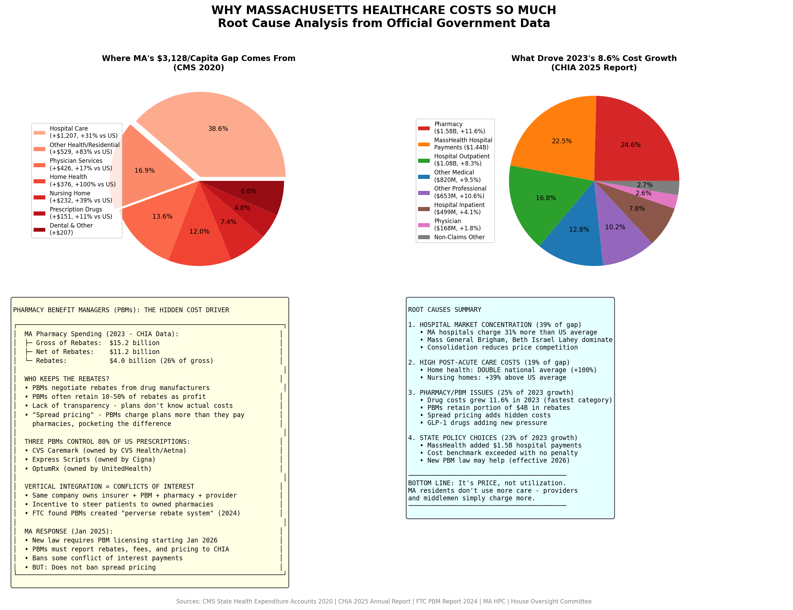
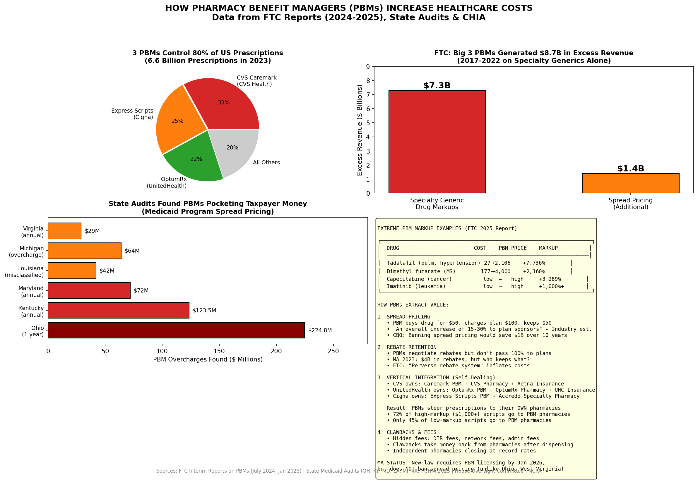
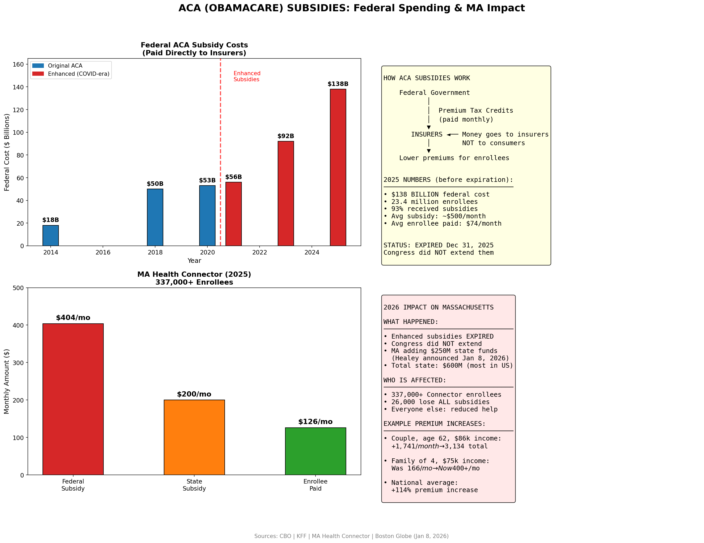

# Massachusetts Healthcare Cost Analysis

**Massachusetts has the highest healthcare costs in the nation.** This repository documents the crisis using official government data.

## ⚠️ Data Notes

| Figure | Year | Data Type | Source |
|--------|------|-----------|--------|
| State Premiums | 2025 | **Estimated** | 2024 KFF + 10% growth rate |
| US Average Premium | 2025 | Actual | KFF EHBS 2025 ($26,993) |
| Per Capita Spending | 2020 | Actual | CMS State Health Expenditure |
| THCE Growth | 2013-2023 | Actual | CHIA 2025 Annual Report |
| Affordability | 2023 | Actual | CHIA 2025 Annual Report |
| 2026 Rate Increases | 2026 | Actual | MA Division of Insurance |

**2025 State Premium Methodology:** KFF does not publish state-level data in the 2025 survey due to sample size limitations. State estimates were derived by applying the KFF-reported 10% national growth rate (from $24,540 to $26,993) to 2024 state figures.

---

## Key Findings

| Metric | Massachusetts | US Average | Gap |
|--------|--------------|------------|-----|
| Family Premium (2025 Est.) | **$30,966** | $26,993 | **+14.7%** |
| Per Capita Spending (2020) | **$13,319** | $10,191 | **+30.7%** |
| 2023 Cost Growth | **8.6%** | 3.6% benchmark | **+139% over** |
| 2026 Rate Increases | **7-14%** | ~3% inflation | **3-4x inflation** |

---

## Visualizations

### 1. State Premium Comparison (2025 Estimated)

### 2. Premium Trends (2019-2025)

### 3. Per Capita Spending (2020)

### 4. Cost Growth vs Benchmark

### 5. Affordability by Race

### 6. Cost Breakdown

### 7. 2026 Rate Increases

### 8. Provider Costs

### 9. Root Causes Analysis

### 10. PBM (Pharmacy Benefit Manager) Analysis

### 11. PBM Cost Impact Summary

### 12. Cost Drivers Comparison

### 13. MassHealth Immigrant Coverage

### 14. ACA Subsidies Overview

### 15. ACA Subsidies Debate

---

## Why Are Costs So High? Root Causes

### 1. Hospital Market Concentration (39% of Gap)
- MA hospitals charge **31% more** than US average
- Mass General Brigham, Beth Israel Lahey dominate market
- Provider consolidation reduces price competition

### 2. Post-Acute Care Costs (19% of Gap)
- Home health: **DOUBLE** national average (+100%)
- Nursing homes: +39% above US average

### 3. Pharmacy & PBM Issues (25% of 2023 Growth)
- Drug costs grew **11.6%** in 2023 (fastest category)
- **$4 billion** in rebates negotiated - but PBMs retain significant portion
- 3 PBMs control 80% of US prescriptions (CVS Caremark, Express Scripts, OptumRx)

**FTC Findings (Jan 2025):**
- Big 3 PBMs generated **$7.3 billion** in excess revenue from specialty generic markups (2017-2022)
- Additional **$1.4 billion** from spread pricing on same drugs
- One drug (tadalafil) marked up **7,736%** ($27 → $2,106)
- 72% of high-markup prescriptions steered to PBM-owned pharmacies
- FTC filed complaint against top PBMs for "artificially inflating insulin prices"

**State Medicaid Audits Found:**
- Ohio: $224.8M pocketed by PBMs in ONE year
- Kentucky: $123.5M annually (triggered AG investigation)
- West Virginia saved $54M first year after becoming its own PBM

### 4. State Policy (23% of 2023 Growth)
- MassHealth added $1.5B in hospital supplemental payments
- Cost benchmark exceeded repeatedly with no penalty
- New PBM law (Jan 2025) requires licensing by 2026, but doesn't ban spread pricing

### 5. MassHealth for Undocumented Immigrants (~$400M/year)
- **MassHealth Limited:** ~$250-300M (emergency services ONLY for ~300,000 adults)
- **Children under 21:** ~$112M (full coverage for ~31,000 kids)
- **Pregnant women:** Full coverage regardless of status
- **Total:** ~1.5-2% of $22B MassHealth budget
- **Context:** Undocumented immigrants paid ~$253M in MA state/local taxes (2018)

**Relative Scale:**
| Cost Driver | Annual Impact |
|-------------|---------------|
| Hospital overcharges | $8.4 billion |
| Post-acute care | $6.3 billion |
| Pharmacy/PBM | $1.6 billion |
| MassHealth supplemental | $1.5 billion |
| Undocumented coverage | $0.4 billion |

Hospital pricing alone is **21x larger** as a cost driver than immigrant coverage.

### 6. ACA (Obamacare) Subsidies - The Political Hot Potato
**Federal Spending:**
| Year | Federal Cost | Enrollment |
|------|-------------|------------|
| 2014 | $18 billion | 5.5 million |
| 2020 | $53 billion | 10 million |
| 2025 | **$138 billion** | 23.4 million |

**What Happened:**
- American Rescue Plan (2021) and IRA expanded subsidies during COVID
- Enhanced subsidies **EXPIRED Dec 31, 2025** - Congress didn't extend
- Subsidies go **directly to insurers**, not consumers

**MA Health Connector Impact (337,000+ enrollees):**
- Average subsidy was $404/month, premium paid $126/month
- **26,000 MA residents** now lose ALL subsidies (income 400-500% FPL)
- Example: 62-year-old couple, $86k income → **+$1,741/month** increase
- Gov. Healey announced $250M from state trust fund (Jan 8, 2026)
- Total state commitment: $600M (largest in US)

**Do Subsidies Add to Healthcare Costs?**
| Argument FOR | Argument AGAINST |
|--------------|------------------|
| $138B federal spending in 2025 | Shifts who pays, not total costs |
| Money goes directly to insurers | Uninsured use expensive ER care |
| Insulates consumers from prices | Keeps healthy people in risk pool |
| Doesn't address root causes | Employer coverage also subsidized |

**Bottom Line: It's PRICE, not utilization.** MA residents don't use more care — providers and middlemen charge more.

---

## Data Sources

| Source | Data | URL |
|--------|------|-----|
| **KFF EHBS 2025** | US national premium ($26,993) | [kff.org/ehbs](https://www.kff.org/health-costs/report/employer-health-benefits-survey/) |
| **KFF EHBS 2024** | State-level premiums (base for estimates) | [kff.org/ehbs](https://www.kff.org/health-costs/report/employer-health-benefits-survey/) |
| **CMS** | Per capita spending by state | [cms.gov](https://www.cms.gov/data-research/statistics-trends-and-reports/national-health-expenditure-data/state-residence) |
| **CHIA 2025** | MA cost growth, affordability, TME | [chiamass.gov](https://www.chiamass.gov/annual-report/) |
| **MA DOI** | 2026 rate filings | [mass.gov](https://www.mass.gov/info-details/2026-health-insurance-rates) |
| **FTC** | PBM Reports (July 2024, Jan 2025) | [ftc.gov](https://www.ftc.gov/news-events/news/press-releases/2025/01/ftc-releases-second-interim-staff-report-prescription-drug-middlemen) |
| **State Audits** | OH, KY, MD, LA, MI, VA Medicaid audits | Various state sources |

---

## Data Files

- `state_premium_2025_estimated.csv` - 2025 state premiums (estimated)
- `state_premium_2024_actual.csv` - 2024 state premiums (actual KFF)
- `premium_trends_2019_2025.csv` - Historical premium trends
- `per_capita_spending_2020.csv` - CMS per capita data
- `thce_growth_vs_benchmark.csv` - MA cost growth history
- `affordability_by_race_2023.csv` - CHIA affordability data
- `cost_breakdown_2020.csv` - Spending by category
- `2026_rate_increases.csv` - DOI rate filings
- `provider_costs_2023.csv` - Provider TME data
- `pharmacy_rebates_2023.csv` - Pharmacy spending gross/net of rebates
- `cost_growth_drivers_2023.csv` - What drove 2023's 8.6% growth
- `pbm_ftc_findings_2025.csv` - FTC findings on PBM excess revenue
- `state_pbm_audit_findings.csv` - State Medicaid audit results
- `pbm_markup_examples.csv` - Extreme PBM markup examples
- `cost_drivers_comparison.csv` - Relative scale of all cost drivers
- `masshealth_immigrant_coverage.csv` - MassHealth coverage for undocumented
- `aca_federal_subsidy_costs.csv` - Federal ACA subsidy costs by year
- `ma_health_connector_2025.csv` - MA Health Connector enrollment & subsidies

---

## License

Data from official government publications (public domain). Analysis: MIT License.

**Last Updated:** January 2025
