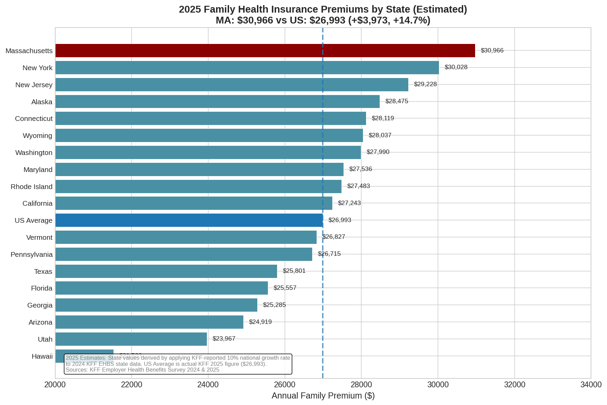
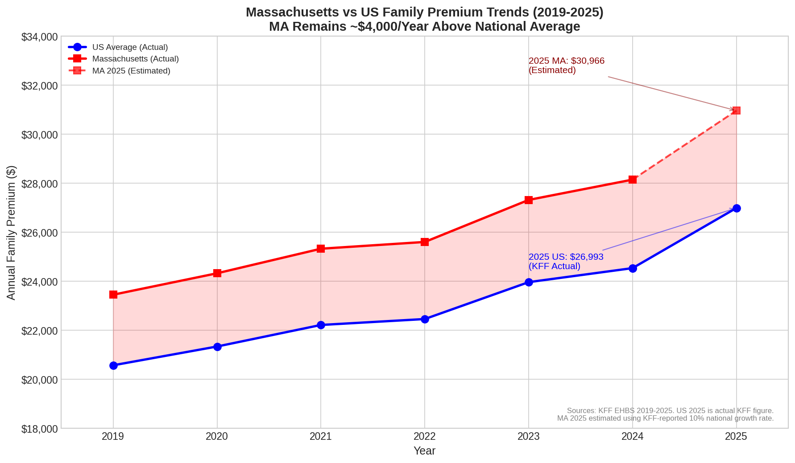
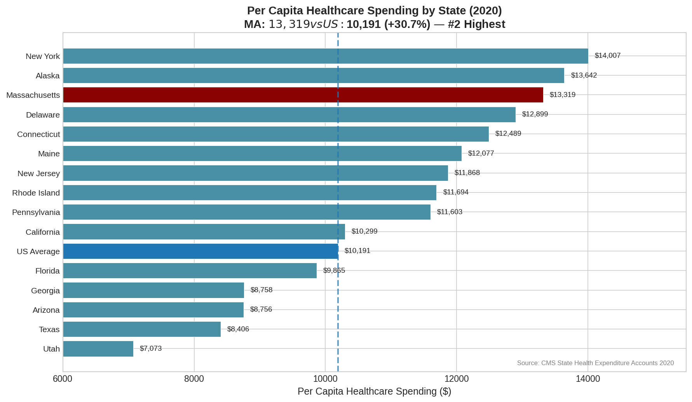
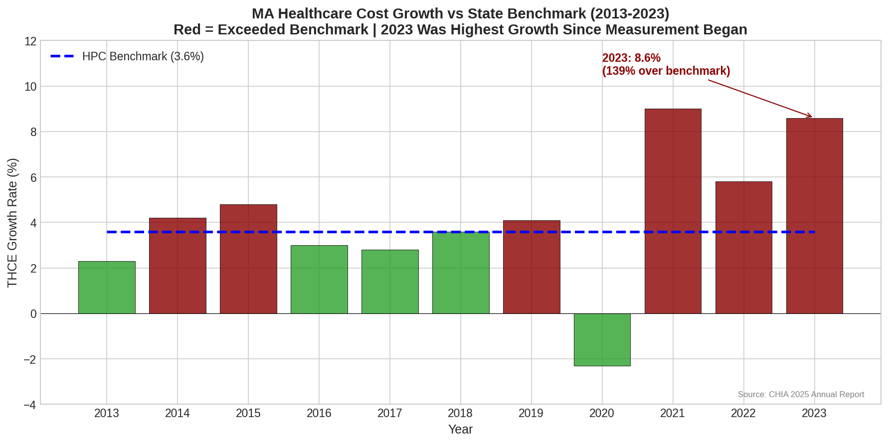
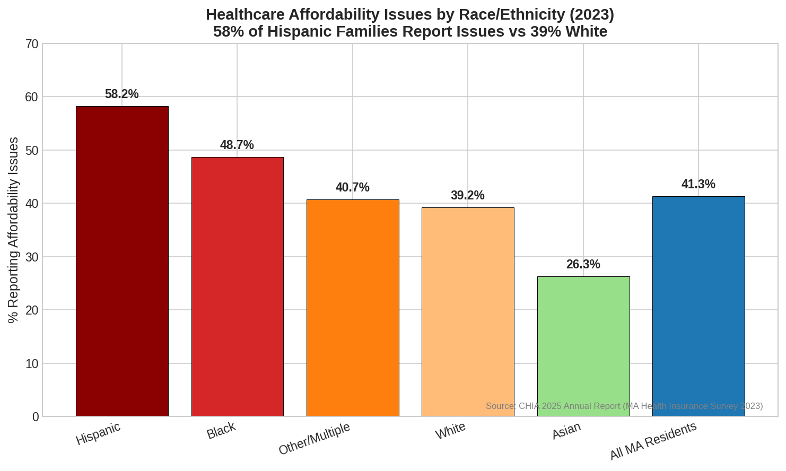
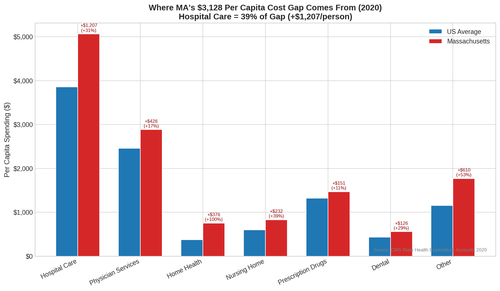
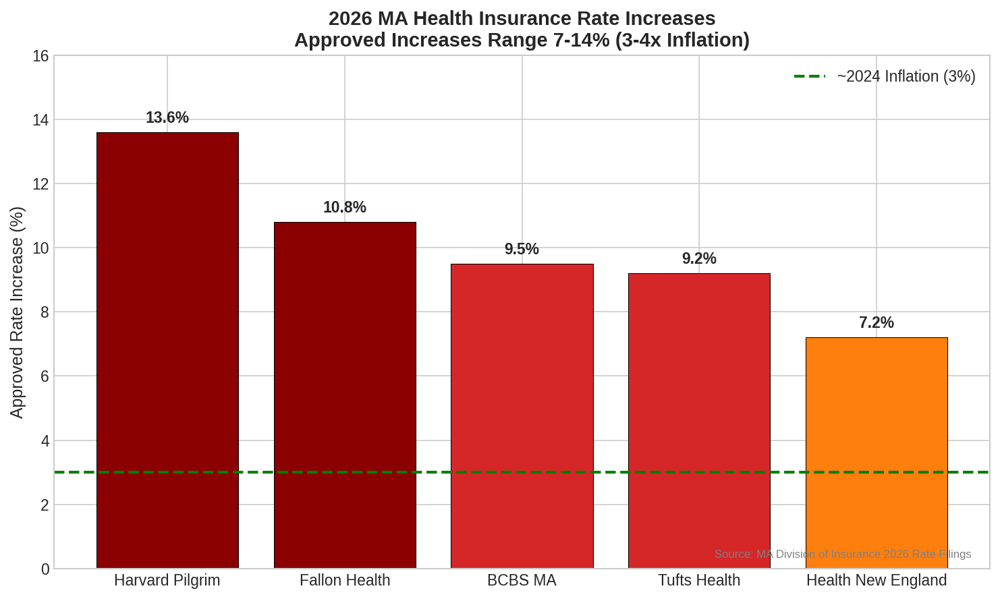

# Massachusetts Healthcare Cost Analysis

**Massachusetts has the highest healthcare costs in the nation.** This repository documents the crisis using official government data.

## ⚠️ Data Notes

| Figure | Year | Data Type | Source |
|--------|------|-----------|--------|
| State Premiums | 2025 | **Estimated** | 2024 KFF + 10% growth rate |
| US Average Premium | 2025 | Actual | KFF EHBS 2025 ($26,993) |
| Per Capita Spending | 2020 | Actual | CMS State Health Expenditure |
| THCE Growth | 2013-2023 | Actual | CHIA 2025 Annual Report |
| Affordability | 2023 | Actual | CHIA 2025 Annual Report |
| 2026 Rate Increases | 2026 | Actual | MA Division of Insurance |

**2025 State Premium Methodology:** KFF does not publish state-level data in the 2025 survey due to sample size limitations. State estimates were derived by applying the KFF-reported 10% national growth rate (from $24,540 to $26,993) to 2024 state figures.

---

## Key Findings

| Metric | Massachusetts | US Average | Gap |
|--------|--------------|------------|-----|
| Family Premium (2025 Est.) | **$30,966** | $26,993 | **+14.7%** |
| Per Capita Spending (2020) | **$13,319** | $10,191 | **+30.7%** |
| 2023 Cost Growth | **8.6%** | 3.6% benchmark | **+139% over** |
| 2026 Rate Increases | **7-14%** | ~3% inflation | **3-4x inflation** |

---

## Visualizations

### 1. State Premium Comparison (2025 Estimated)

### 2. Premium Trends (2019-2025)

### 3. Per Capita Spending (2020)

### 4. Cost Growth vs Benchmark

### 5. Affordability by Race

### 6. Cost Breakdown

### 7. 2026 Rate Increases

### 8. Provider Costs

---

## Data Sources

| Source | Data | URL |
|--------|------|-----|
| **KFF EHBS 2025** | US national premium ($26,993) | [kff.org/ehbs](https://www.kff.org/health-costs/report/employer-health-benefits-survey/) |
| **KFF EHBS 2024** | State-level premiums (base for estimates) | [kff.org/ehbs](https://www.kff.org/health-costs/report/employer-health-benefits-survey/) |
| **CMS** | Per capita spending by state | [cms.gov](https://www.cms.gov/data-research/statistics-trends-and-reports/national-health-expenditure-data/state-residence) |
| **CHIA 2025** | MA cost growth, affordability, TME | [chiamass.gov](https://www.chiamass.gov/annual-report/) |
| **MA DOI** | 2026 rate filings | [mass.gov](https://www.mass.gov/info-details/2026-health-insurance-rates) |

---

## Data Files

- `state_premium_2025_estimated.csv` - 2025 state premiums (estimated)
- `state_premium_2024_actual.csv` - 2024 state premiums (actual KFF)
- `premium_trends_2019_2025.csv` - Historical premium trends
- `per_capita_spending_2020.csv` - CMS per capita data
- `thce_growth_vs_benchmark.csv` - MA cost growth history
- `affordability_by_race_2023.csv` - CHIA affordability data
- `cost_breakdown_2020.csv` - Spending by category
- `2026_rate_increases.csv` - DOI rate filings
- `provider_costs_2023.csv` - Provider TME data

---

## License

Data from official government publications (public domain). Analysis: MIT License.

**Last Updated:** January 2025
